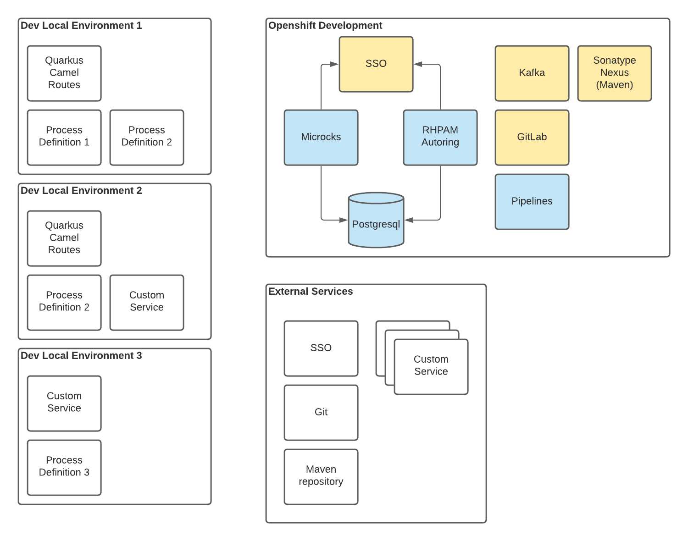
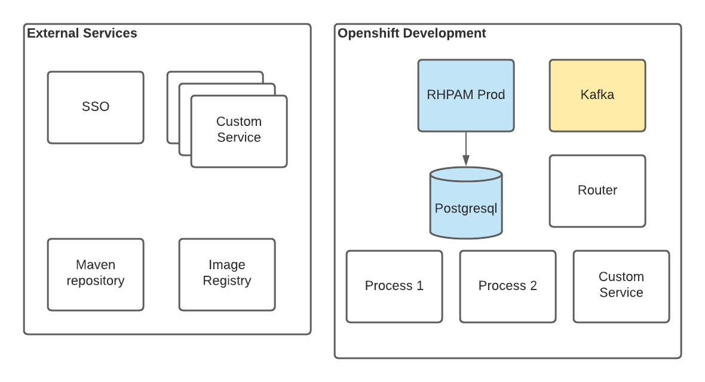

# Mercury usage examples

## Development Deployment

With the following custom resource, the Mercury Operator will be able to deploy in the given
namespace all the necessary resources the development team will require.

In this example, a development environment for Customer Offer service domain will be
deployed. There are some defaults assumed:

* Microcks for testing with the pre-populated tests for Customer Offer
* RHPAM Authoring environment integrated with SSO
* Postgresql database created and shared by Microcks, RHPAM and RH-SSO
* RH-SSO is deployed and pre-propulated with an example domain
* Pipelines:
  * Router built, pushed to the image registry and deployed after each merge to main branch
  * BPM processes and decisions are built and pushed to a maven registry
  * Custom services are built and the image is to the image registry and deployed locally
* Sonatype Nexus maven repository for CI and intermediate cache for builds
* Openshift registry used for local builds



```{yaml}
apiVersion: mercury.redhat.com/v1alpha1
kind: CustomerOffer
metadata:
  name: sd-co-env
spec:
  environment: development
  auth:
    type: rh-sso
  persistence:
    type: postgresql
  git:
    type: github
    github:
      accessToken: <access-token>
  router:
    repository: my-company/sd-customer-offer
  bpm:
    - name: my-process-1
      type: bpmn
      repository: my-company/sd-co-process1
    - name: my-decision
      type: dmn
      repository: my-company/sd-co-decision1
  customServices:
    - name: my-custom-svc-1
      type: quarkus
      repository: my-company/sd-co-custom-svc-1
  evenving:
    type: kafka
  
```

## Initial bootstrap

From the previous environment any developer could leverage the mercury CLI to fetch
the configuration and use it to bootstrap the router and bpm projects. For example it can
preconfigure the SSO and databases for the development profile. However, during deployment 
the configMaps and secrets will be used instead to make the deployment valid for production as well.

```{bash}
$ mercury create router --domain=customer-offer --groupId=org.example --artifactId=my-customer-offer --version=1.0.0-SNAPSHOT --extensions=direct,http,kafka,salesforce,servicenow --env=sd-co-env

Created my-customer-offer project for Customer Offer domain

$ mercury create bpm --groupId=org.example --artifactId=my-customer-offer --version=1.0.0-SNAPSHOT --env=sd-co-env

Created BPMN project my-process-1
Created DMN project my-decision

```

## Production Deployment

This production environment should be immutable and only rely on built artifacts like
maven artifacts or container images, therefore no pipelines or mocking should be needed.

In this example where the Customer Offer service domain is deployed, the following
applications are configured:

* External RH-SSO integrated with RHPAM
* RHPAM production immutable environment, configured to deploy the bpm artifacts
* Postgresql persistence database that can be used by RHPAM



```{yaml}
apiVersion: mercury.redhat.com/v1alpha1
kind: CustomerOffer
metadata:
  name: sd-co-prod
spec:
  environment: production
  auth:
    type: rh-sso
    url: https://external.sso.example.com/auth/
    realm: some-realm
  persistence:
    type: postgresql
  router:
    image: quay.io/my-company/sd-co-router:1.0
  bpm:
    - name: my-process-1
      gov: org.example.my-company:sd-co-process1:1.0
    - name: my-decision
      gov: org.example.my-company:sd-co-decision1:1.2
  customServices:
    - name: my-custom-svc-1
      image: quay.io/my-company/my-custom-svc-1:2.5
  evenving:
    type: kafka
  
```
